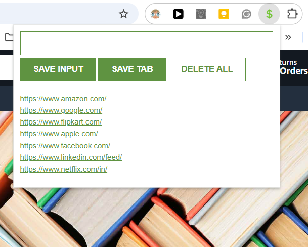

# 📎 LeadSnap

A lightweight Chrome extension that helps you save and manage important URLs with ease. Perfect for sales professionals, researchers, or anyone who needs to keep track of multiple web resources.

## 🌟 Features

- Save URLs manually through text input
- Quick-save current tab URL with one click
- Store leads/URLs persistently using local storage
- Open saved URLs in new tabs
- Double-click protection for deletion
- Clean, minimalist interface

## 🛠️ Technical Stack

- HTML5
- CSS3
- Vanilla JavaScript
- Chrome Extension API
- Local Storage API

## 📥 Installation

1. Clone this repository or download the ZIP file
2. Open Chrome and navigate to `chrome://extensions/`
3. Enable "Developer mode" in the top right corner
4. Click "Load unpacked" and select the LeadSnap directory
5. The extension icon should now appear in your Chrome toolbar

## 🎯 Usage

1. Click the LeadSnap icon in your Chrome toolbar
2. To save a URL manually:
   - Type or paste the URL in the input field
   - Click "SAVE INPUT"
3. To save the current tab:
   - Click "SAVE TAB"
4. To delete all saved URLs:
   - Double-click "DELETE ALL"

## 🔑 Permissions

The extension requires the following permissions:
- `tabs`: To access the current tab's URL

## 🎨 Preview

## 🤝 Contributing

Feel free to fork this project and submit pull requests. You can also open issues for bugs or feature suggestions.

## 🔄 Version

Current Version: 2.0

---
Made with ❤️ by Haneesh Hasan
